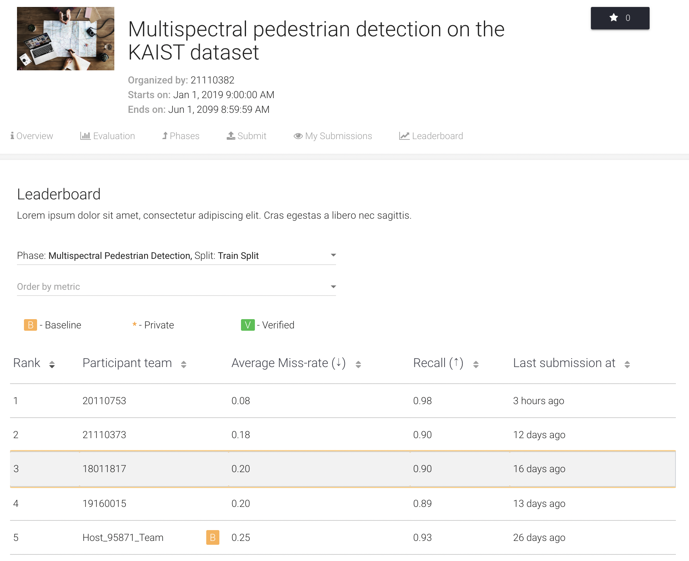

# [2021 Computer-Vision] Multispectral Pedestrain Detection

📌 2021학년도 2학기 세종대학교 컴퓨터비전 텀프로젝트 2단계

```
Halfway Fusion (Multispectral Pedestrain Detection)
```

📍 Eval_AI 리더보드 [바로가기](http://203.250.148.129:3088/web/challenges/challenge-page/52/overview)   
📍 텀프로젝트 2단계 설명 영상 [바로가기]()

